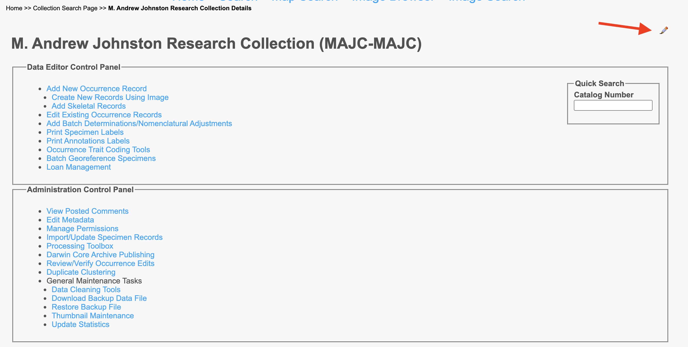

# Collection Editor / Admin Tools - Ecdysis portal

Tools are available for any collection a user is granted permissions for.

* First go to the collection page by one of three ways
  * Click on the 'more info' link next to a collection on the search page
  * Go to the 'Sitemap' by clicking the link in the upper right-hand corner and scroll down to the collection under the list of collections you may have access to.
  * Go to 'My Profile' using the link in the upper right-hand corner and clicking on the 'Occurrence Management' tab and then selecting the desired collection.
* If you do not have access to a collection that you think you should - contact one of hte people listed under that collection's profile to request access.

#### The editor/admin menus are toggled by clicking the +pencil icon on the right-hand side of the collection profile page immediately above the collection title (red arrow in screenshot below).

## Editor Tools
These tools are what most users will have access to for general collections-related tasks.
* 'Add New Occurrence Record' is the most commonly used tool. See the [Add New Occurrence Workflow](/workflows/specimenDigitization/)

## Administrator Tools
These tools are only available to collection administrators and generally involve the ability to do drastic changes to the collection metadata, allow new users to access the collection, and give access to a number of powerful (and potentially dangerous) batch-update tools.
