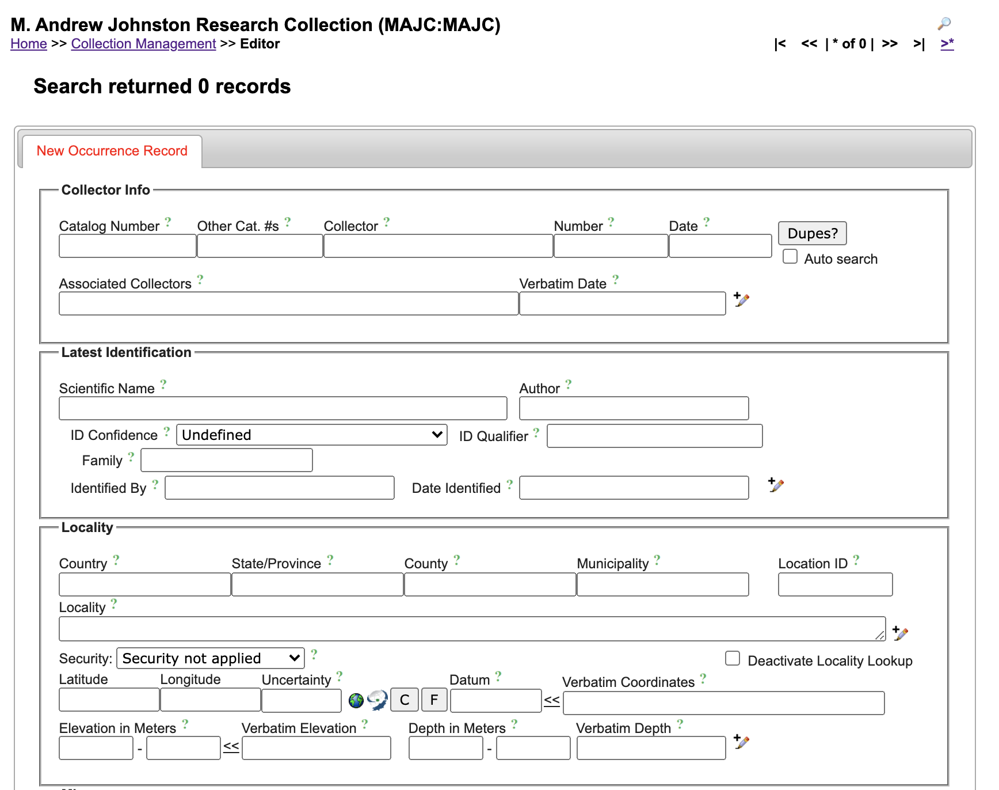
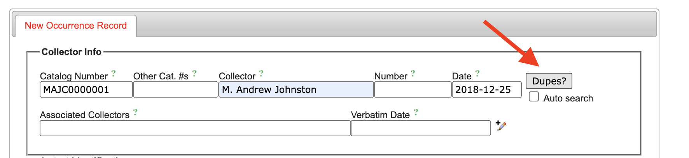
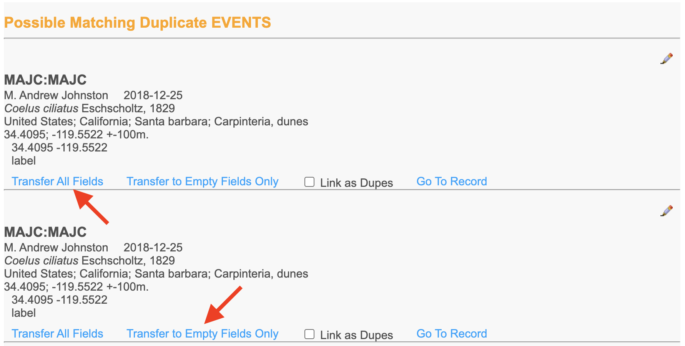
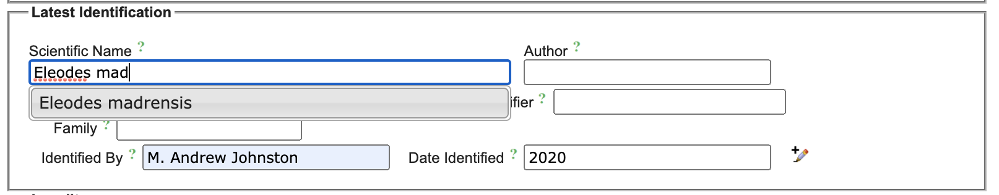
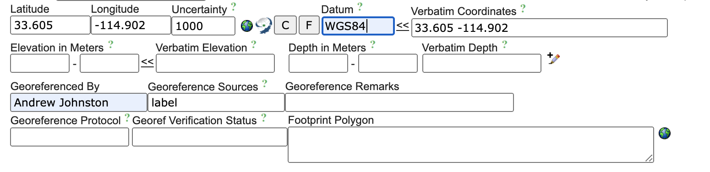
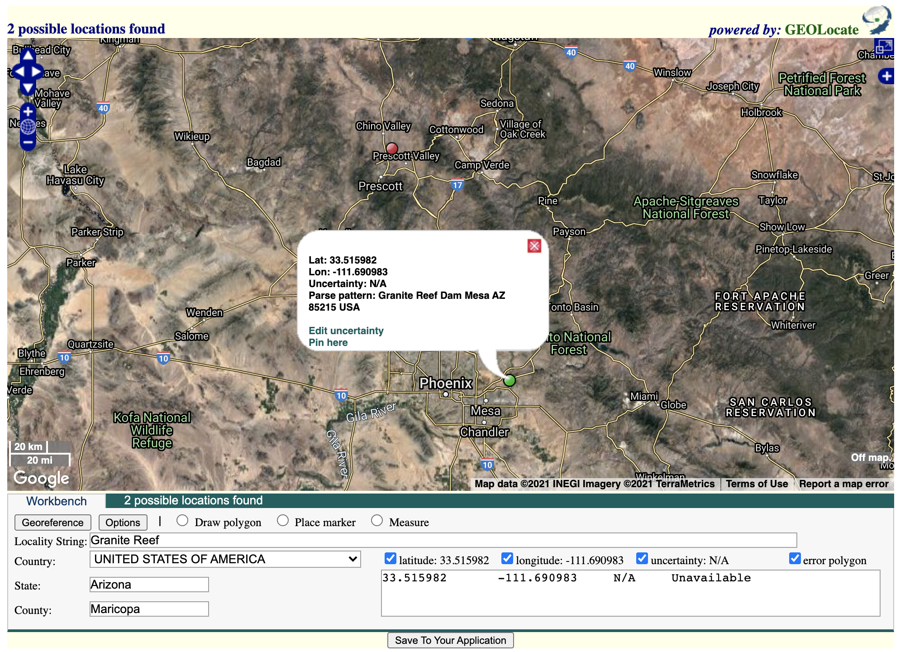
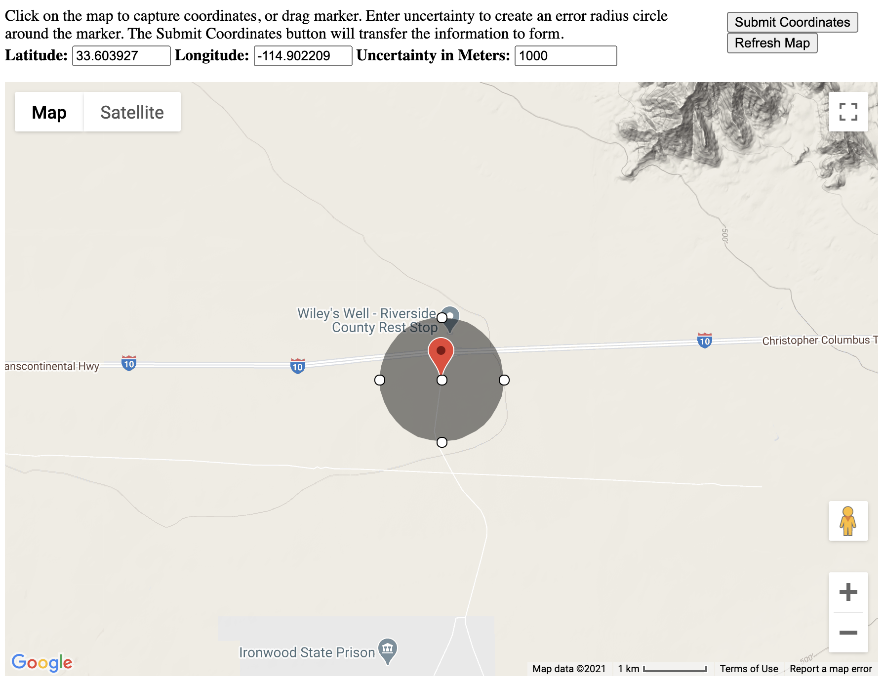
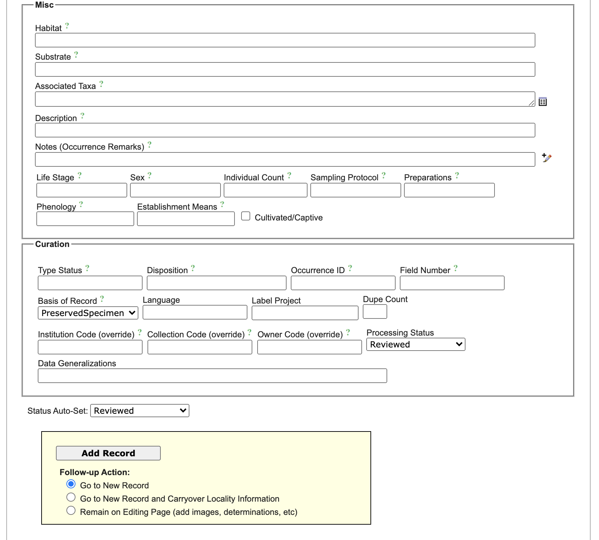

# Specimen Digitization - Ecdysis portal

To digitize a specimen, go to the proper collection in Ecdysis and toggle the editor/admin panel.  See collection tools workflow for locating and operating these tools.

Click on the 'Add New Occurrence Record' link to go to the record digitization form.

## Primary occurrence data
These fields are somewhat self explanitory and the green question-mark icon will bring up additional information on the Darwin-Core term for that field.

### Enter base data and look for previous records from same collecting event

* Start by entering the unique catalog number which matches the physical label being added to the specimen.
* Enter the collector name (at least last name, write as it appears on the label) and the date from the specimen (translate to the format YYYY-MM-DD).
* Click the 'Dupes' button to search the database for possible duplicate specimens collected by a person with the same last name on the given date.

* If possible duplicates exist, a window will pop-up with matches.
* If one of the possible matches is the same as the specimen in front of you, click the 'Transfer all fields' to transfer all the data to your current specimen record.  You may also select 'Transfer to empty fields only' if you have already digitized part of the specimen and you do not wish to overwrite that information.
* If you transfer full data, then most likely the only data still needed is the determination data. 

#### Enter additional collector data
* Add any additional collectors in the 'Additional Collectors' field
* The 'Verbatim Date' field should contain only the date as exactly typed/written on the specimen label, or it can be left blank.
* Clicking the +pencil icon opens additional date fiends which include the ability to add a range of dates, e.g. for specimens from long term traps.

#### 

### Latest Identification Data
This part of the form is where the current/latest identification is added at the time of digitization. Future new determinations can be added by the batch annotation tool or using the identifications tab on an existing record.

* Almost all identifications will include a taxon name, a determiner, and a date determined (almost always simply a year for insect specimens)
* By starting to type a scientific name, matches are shown as a drop-down menu.  If the taxon is not in the taxonomy, it should be added to the portal taxonomic thesaurus.
* Add any additional information about the identification such as qualifiers (e.g., c.f. near, etc), notes, or known identification resources.

#### 

### Basic Locality Data
These fields are largely self explanitory.  For specimens collected in the USA, COuntry, State, and County are used while the remaining data are placed in the Locality field.
* Use 'United States' for USA.
* For the locality field, try to transcribe the label data as verbatim as possible.  Expanding 'mtns' to 'mountains' or 'cyn' to 'Canyon' is generally preferred if it is definitively known what the abbreviation stands for.  Add spaces as needed that may have been taken off of original label for space savings.
* Elevation should only be entered if it is specificlly listed on the label.  Add the elevation in the verbatim field (e.g., as '3000'' or '500m') and click the double-carot button next to it.  This will translate the verbatim elevation into meters.

### Georeferencing
Georeferencing is the act of adding GPS coordinates to the digitized specimen record.  There are multiple ways to find the correct GPS coordinates, and whichever way the were found should be annotated on the specimen.

##### Georeferencing should be performed in this preferred order:  Label coordinates > GeoLocate (needs quality checking) > Google Earth (needs quality checking)

#### Coordinates on Label
Add the coordinates as they appear on the label (e.g. as decimal degrees or in minutes/seconds, cardinal directions, etc) in the verbatim coordinates field. Convert or transfer these digits to the Latitude and Longitude field.  **Be sure to add WGS84 as the 'Datum' field.** Double check using the Google Maps feature below.

#### Georeference utilizing GeoLocate
Click the map-swirl icon next to the GPS coordinate fields to open the GeoLocate popup.  This must be done after the locality information is already filled in. This will present you with any interpretations of the locality data inferred by the GeoLocate software and database.

* If any options are given, select the one that seems the most accurate.
* If needed, do some googling to confirm that the point on the map is actually the locality listed on the label.
* If you need to you can place your own marker nearby.  This might be needed if you are placing a marker 5 miles east of a location for example.
* Distances are typically measured from crossroads.

#### Georeference utilizing Google Maps
Google Maps can be utilized within Ecdysis by clicking the globe next to the GPS coordinate fields.  This canbe used to manually click on a map or to visualize verbatim GPS data.  This will pop up a new window that will show a point on the map and a radius for any input uncertainty.

* Follow onscreen instructions to apply new GPS data after clicking on a point on the map.
* Visualize existing coordinates from the label to make sure they were accuratly put onto the label.

#### Uncertainty
ALl GPS data should be accompanied by an uncertainty term.  GeoLocate will usually automatically add these data.  For labels with printed GPS points, add a value of meters that seems appropriate - e.g., 10 for a specific trap location, 100 for a general collecting label, etc.  For localities that were georeferenced by hand, apply an uncertainty that makes sense.  This might be 1000 (1km) fora location 3 miles from an intersection along a straight road.  If a locality is something like "Phoenix" then the uncertainty might be something like 100000 (100km).

#### Add additional georeference data
Toggle the additional georeferencing fields by clicking the +pencil icon on the left-hand side of the box.
* Add your name as the georeferencer (or leave it filled in as the original person who did so if you copy loclaity data from the 'Dupes' feature).
* Always add 'Georeference Sources' information, typically 'label' or 'GeoLocate' or 'Google Earth'

## 
## Digitize additional occurrence data and metadata
Any additional label data or specimen metadata can be added in the last two groups of fields called 'Misc' and 'Curation' at the bottom of the page.

* Label data about habitat or substrate can be added to the appropriate fields
* 'Occurrence Remarks' is a catch-all field that can hold any other information about the specimen or on the label that doesn't fit elsewhere.
* Specimen information such as life stage, individual count, and phenology are somewhat self explanatory.  Generally a pinned insect is simply 'adult' and '1' for life stage and individual count.
* 'Preparations' is where data like 'Pinned Specimen' or 'slide mounted' or 'dissection' can be applied.
* 'Type Status' (e.g., Holotype or paratype, etc) and Disposition (in the MAJC used for the tissue collection freezer location) and other possible override fields are available inthe curation section.  These are generally not used for most specimens being digitized. 

## 
## 

