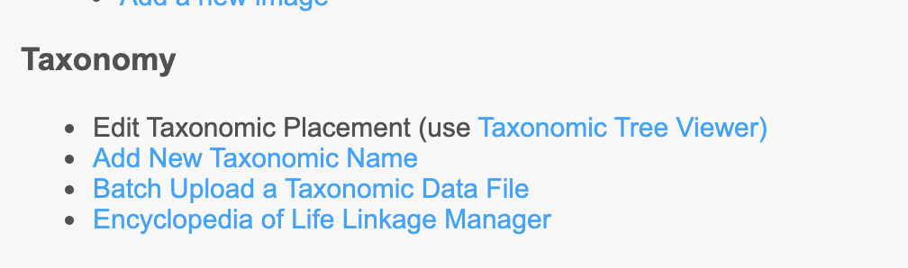

# Taxonomy Editor Tools - Ecdysis Portal

Any user that is flagged as a Taxonomy Editor can access the tools from the Sitemap which is found by clicking the link in the upper right-hand corner of any page.

## More to come...

### Adding a new taxon name

### Editing an existing taxon name

### Creating a synonym
